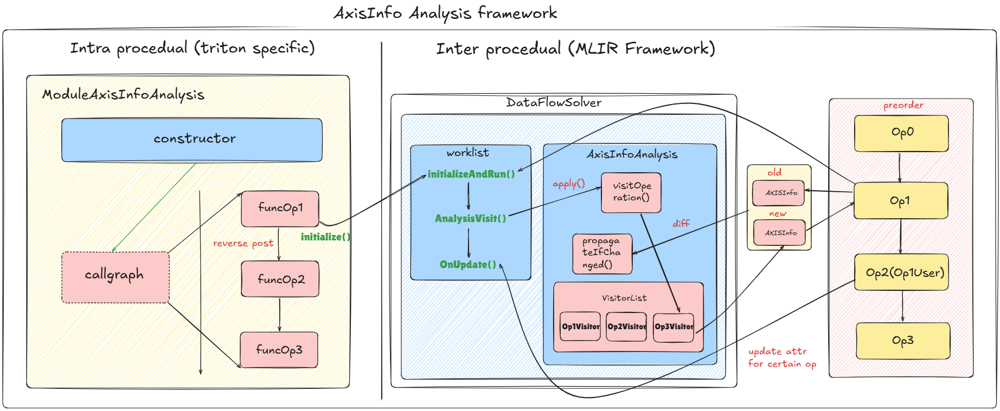

 # Triton Deep Dive
In this doc, we will dive into triton internals, to show how our hand-written triton-lang is lowered into ptx/cubin and finally launched by cuda driver. This doc is organized into following parts:  
* Overall framework 
* Source code structure
* Dive into jit compilation (Python)
* Pybind gluer
* MLIR Lowering passes (C++)

## Chapter1: Overall Framework
The [Triton](https://github.com/triton-lang/triton) codes nowadays is actually quite different from the original [paper](https://dl.acm.org/doi/10.1145/3315508.3329973). There are two major differences:  
1. Python DSL is introduced to make it easier for model developers. Pythonic is the trend nowadays in ML compiler world :key:.
2. Passes are all rewritten in MLIR, making it more extendible.  

So we can clearly see two different parts in this shift, a python wrapper for user end, and the actual code optimization and conversion realized in C++ with MLIR ecosystem, glued by [pybind](git@github.com:pybind/pybind11.git) mechanism.  

With this bluescript in mind, we now try to touch three important questions:  
1. What is the input?
2. What are temporaries and final codes during Triton compilation?
3. How are those compiled codes loaded by device driver?   

Let's explain these questions one by one.

> :question: What is the input?  
> Input of triton source code merely contains three parts: (1) triton kernel (2) kernel wrapper that can easily replace counterpart operator in certain ml models (3) data preparation and kernel launch. Below is a basic code sample:  
```python
@triton.jit  
def _kernel(...):
    pass

def kernel(...):
    _kernel[grid](...)  # SPMD programming model

# data preparation
A ...
B ...
C ...
# kernel call
D = kernel(A, B, C)
# correctness test and perf test
...
```

> :question: What are the temporaries and the final codes?  
> All temporaries are saved on disk, user can set TRITON_CACHE_DIR, or by default the dir path is ~/.triton/cache. Following figure shows files in the triton cache:  
>   
Here is a simple descriptions for those files:   
`cuda_utils.so`contains cuda helper functions for correct cuda launching. `triton_launcher.so`helps launch cuda kernels. `.source` is user-written triton dsl, `.ttir` is a one-to-one mapping ir, `ttgir` is gpu aware ir, `llir` is llvm ir converted from `ttgir`. Final result is `.ptx`, a cuda assembly. `.json` contains all the metadata of this kernel, which can help jit compile and launch(hash this compiled kernel for future use).
  
> :question: How are ptx kernel launched by device driver?  
> Secrete lies in `.so` file. This file contains wrapper for `cuKernelLaunch` function、grid configurations and parameters, which enable python to dynamically load this .so with importlib, and finally launch ptx/cubin kernels with control of device driver.  

With these answers in mind, we can get a clearer roadmap of triton compiler. Then let's touch source code to make it more solid. First let's have a overall understanding of the codebase structure.

## Chapter2: Source code structure  
Triton Compiler project contains following directories:  
* `/python/triton/tools/compile.py` – The top-level compiler tool.
* `/python/triton/runtime/jit.py` – The runtime utility, which includes kernel compilation cache, source data management, driver interaction, and kernel scheduling. :key:
* `/python/triton/compiler/code_generator.py` – Mainly handles the AST generated by the DSL, translating it into MLIR IR (i.e., Triton IR).
* `/third_party/nvidia/backend/compiler.py` – The compilation pipeline for specific hardware vendors, such as NVIDIA’s CUDA flow. Typically involves the transformation of TritonGPU IR and code generation for PTX and beyond. :key:
* `triton/python/src/passes.cc` – Glue layer(pybind) that organizes the various passes. :key:
* `*/lib` - cpp codebase, contains mlir source code for ir optimization, analysis and conversion. :key:
* `*/include` - header file for lib. :key:  

Let's first dive into python layer, to grasp how JIT compilation works in triton.

## Chapter3: JIT compile  
This part, we focus on `python/triton/runtime/` repository, mainly `jit.py` , `compile.py` and `build.py`. First let's see a flowgraph to have a general understanding of triton jit compilation:  


We can divide the whole jit compile workflow into three parts, and readers can refer to source code each part for further understanding: 
* Jit Interface: this part mainly deal with user-written triton-lang kernel and kernel launch. Jit main function is [here](https://github.com/triton-lang/triton/blob/main/python/triton/runtime/jit.py#L885-L937), and there are two main classes that we should pay attention with, JitFunction and its parent class KernelInterface. In KernelInterface, we should focus on [`__getitem__()`](https://github.com/triton-lang/triton/blob/main/python/triton/runtime/jit.py#L411-L421)function, which is the entry of `kernel[grid]()`. And in JitFunction, [`run()`](https://github.com/triton-lang/triton/blob/main/python/triton/runtime/jit.py#L693-L744) function is quite essential.
* Compilation: this part works when our kernel is firstly compiled, no previous cached kernel matched. This part is mainly written in mlir c++, turn to [`make_ttir()`](https://github.com/triton-lang/triton/blob/main/third_party/nvidia/backend/compiler.py#L229-L243),[`make_ttgir()`](https://github.com/triton-lang/triton/blob/main/third_party/nvidia/backend/compiler.py#L245-L323),[`make_llir()`](https://github.com/triton-lang/triton/blob/main/third_party/nvidia/backend/compiler.py#L341-L411),[`make_ptx()`](https://github.com/triton-lang/triton/blob/main/third_party/nvidia/backend/compiler.py#L413-L443) and [`make_cubin()`](https://github.com/triton-lang/triton/blob/main/third_party/nvidia/backend/compiler.py#L435-L494) for further dive. This pipeline is the keypoint in next chapter.   
    > This pipeline is vendor specific. For Nvidia GPU, refer to [cuda backend compiler](https://github.com/triton-lang/triton/blob/main/third_party/nvidia/backend/compiler.py).
* Runtime & Driver: this part first turn compiled cubin into `.so` lib, refer [here](https://github.com/triton-lang/triton/blob/main/python/triton/compiler/compiler.py#L412-L441). Then use [`init_handle()`](https://github.com/triton-lang/triton/blob/main/python/triton/compiler/compiler.py#L443-L472) to init a cuda stream and all metadata. Finally use [`launcher_cls`](https://github.com/triton-lang/triton/blob/main/third_party/nvidia/backend/driver.py#L723-L726) to evoke a [`CudaLuancher`](https://github.com/triton-lang/triton/blob/main/third_party/nvidia/backend/driver.py#L677-L718) class and finally launch a cuda kernel.

Hoping by following the flow graph and descriptions of each key part of JIT compilation, readers can get a clear picture of the whole python codebase and jit flow. Then comes the most exciting part to MLIR compilers, the actual code transformation and optimizations, proposing many interesting and advanced gpu compilation techniques such as: [triton layout](https://www.lei.chat/posts/triton-linear-layout-concept/), coalesce opt, tensor core opt, etc. 

## Chapter4: MLIR Lowering Passes
This part, we enter the core optimization pipeline of Triton. The whole lowering pipeline is: triton-lang -> ttir -> ttgir -> llir -> ptx -> cubin. Refer to [triton pipeline](./pipeline) for detailed code transformation of a basic vector add triton-lang operator.  

### TTIR
```python
@staticmethod
def make_ttir(mod, metadata, opt, capability):     # triton ir，主要描述上层计算行为
    import pdb
    pdb.set_trace()
    pm = ir.pass_manager(mod.context)
    pm.enable_debug()
    passes.common.add_inliner(pm)
    passes.ttir.add_rewrite_tensor_pointer(pm)
    if capability // 10 < 9:
        passes.ttir.add_rewrite_tensor_descriptor_to_pointer(pm)
    passes.common.add_canonicalizer(pm)
    passes.ttir.add_combine(pm)
    passes.ttir.add_reorder_broadcast(pm)
    passes.common.add_cse(pm)
    passes.common.add_symbol_dce(pm)
    passes.ttir.add_loop_unroll(pm)
    pm.run(mod)
    return mod
```

In this doc, we only focus on Triton-specific optimizations, that are [`RewriteTensorPointer`](https://github.com/triton-lang/triton/blob/main/lib/Dialect/Triton/Transforms/RewriteTensorPointer.cpp), [`Combine`](https://github.com/triton-lang/triton/blob/main/lib/Dialect/Triton/Transforms/Combine.cpp) and [`ReorderBroadcast`](https://github.com/triton-lang/triton/blob/main/lib/Dialect/Triton/Transforms/ReorderBroadcast.cpp) three passes. This part highly refer to [OpenAI Triton 源码走读[transforms in ttir]](https://tfruan2000.github.io/posts/triton-source-code-1/).

#### RewriteTensorPointer
The figure below shows all details on how this pass do to `tl.make_block_ptr` and `tl.advance` operations.  


Refer to [Before-pass-example](../Triton-101/DeepDive/ttir/test/test_rewrite.mlir) and [After-pass-example](../Triton-101/DeepDive/ttir/test/result1.mlir) to see detailed effects of this pass.

> A tip to help debug pattern rewrite in mlir: use `-debug-only=greedy-rewriter`. Refer to [Pattern Rewrite](https://mlir.llvm.org/docs/PatternRewriter/) for further details.

#### Combine
The table below shows all combination rules that triton applied:  

| Pattern Name                        | Match Rule                                                                                  | Rewrite Result                                             | Optimization Purpose                                                                                   |
|-------------------------------------|---------------------------------------------------------------------------------------------|------------------------------------------------------------|--------------------------------------------------------------------------------------------------------|
| CombineDotAddIPattern               | `AddIOp(d, DotOp(a, b, c=0))`                                                               | `DotOp(a, b, d)`                                           | Merge dot with zero-init + add to eliminate redundant `add`.                                           |
| CombineDotAddFPattern               | `AddFOp(d, DotOp(a, b, c=0, maxNumImpreciseAcc=0))`                                         | `DotOp(a, b, d)`                                           | Same as above, but for floating-point add, restricted to `maxNumImpreciseAcc == 0`.                    |
| CombineDotAddIRevPattern            | `AddIOp(DotOp(a, b, c=0), d)`                                                               | `DotOp(a, b, d)`                                           | Same as `CombineDotAddIPattern`, but with `dot` on the left-hand side.                                |
| CombineDotAddFRevPattern            | `AddFOp(DotOp(a, b, c=0, maxNumImpreciseAcc=0), d)`                                         | `DotOp(a, b, d)`                                           | Same as `CombineDotAddFPattern`, but with `dot` on the left-hand side.                                |
| CombineAddPtrPattern                | `addptr(addptr(ptr, idx0), idx1)`                                                           | `addptr(ptr, AddIOp(idx0, idx1))`                          | Merge multi-level pointer offsets to avoid nested `addptr`; preserve optional attributes (div/cont/const). |
| CombineSelectMaskedLoadPattern      | `select(cond, load(ptrs, splat(cond), ?), other)`                                           | `load(ptrs, splat(cond), other)`                           | Merge `select`-wrapped masked load into a more concise `load`.                                        |
| CombineBroadcastMulReducePattern    | `reduce(sum, broadcast(x[:, :, None]) * broadcast(y[None, :, :]))`                          | `dot(x, y)`                                                | Recognize matrix multiplication pattern (broadcast-mul-reduce) and replace with efficient `dot`.       |
| CombineReshapeReducePatterns        | `reshape(tensor)` (1D, `allowReorder=false`, user is reduce/histogram)                      | set `allowReorder=true`                                    | Enable element reordering for 1D tensor reshape in reduction/histogram cases, improving optimization. |
| RankedReduceDescriptorLoads         | `reshape(descriptor_load(...))` with rank-reducing reshape                                  | absorb reshape into `descriptor_load` and modify result type | Eliminate meaningless reshape by folding it into `descriptor_load`.                                   |


#### ReorderBroadcast
The table below lists all broadcast + elementwise reorder rules that triton applied:

| Pattern Name | Original Form | Reordered Form | Conditions | Purpose |
|--------------|--------------|----------------|------------|---------|
| MoveSplatAfterElementwisePattern | `elementwise(splat(a), splat(b), ...)` | `splat(elementwise(a, b, ...))` | - All operands are `SplatOp` or constant splats.<br>- Operation is **elementwise** and has no side effects. | Compute on scalars first, then splat once → avoids redundant tensor elementwise ops. |
| MoveBroadcastAfterElementwisePattern | `elementwise(broadcast(a), splat(b), ...)` | `broadcast(elementwise(a, b, ...))` | - At most one broadcast operand.<br>- All broadcasts must expand to the **same shape**.<br>- Operation is **elementwise** and has no side effects. | Compute on the smaller source tensor, then broadcast once → reduces duplicated computation. |
| Canonicalization (built-in) | e.g., `broadcast(broadcast(a))`, `expand_dims(expand_dims(a))` | Simplified canonical form | Provided by `BroadcastOp` and `ExpandDimsOp`. | Normalizes IR to expose more rewrite opportunities and remove redundant ops. |  

These three passes are all hardware-agnostic optimizations, to make further analysis and transformation more efficient. 

### TTIR -> TTGIR
This part highly refer to [OpenAI Triton 源码走读[ttir-2-ttgir]](https://tfruan2000.github.io/posts/triton-source-code-2/), [Triton Linear Layout: Concept](https://www.lei.chat/posts/triton-linear-layout-concept/) and [Triton Axis Analysis](https://zhuanlan.zhihu.com/p/687394750). Let's first see what this pass make changes to IR.

`IR before conversion`
```cpp
module {
  tt.func public @add_kernel(%arg0: !tt.ptr<f32> {tt.divisibility = 16 : i32} loc("/mnt/home/douliyang/triton-workspace/triton-tutorial/tutorial/Triton-101/Debug/vector_add.py":32:0), %arg1: !tt.ptr<f32> {tt.divisibility = 16 : i32} loc("/mnt/home/douliyang/triton-workspace/triton-tutorial/tutorial/Triton-101/Debug/vector_add.py":32:0), %arg2: !tt.ptr<f32> {tt.divisibility = 16 : i32} loc("/mnt/home/douliyang/triton-workspace/triton-tutorial/tutorial/Triton-101/Debug/vector_add.py":32:0), %arg3: i32 {tt.divisibility = 16 : i32} loc("/mnt/home/douliyang/triton-workspace/triton-tutorial/tutorial/Triton-101/Debug/vector_add.py":32:0)) attributes {noinline = false} { ... }
}
```

`IR after conversion`
```cpp
#blocked = #ttg.blocked<{sizePerThread = [1], threadsPerWarp = [32], warpsPerCTA = [4], order = [0]}>
#loc = loc("/mnt/home/douliyang/triton-workspace/triton-tutorial/tutorial/Triton-101/Debug/vector_add.py":32:0)
module attributes {"ttg.num-ctas" = 1 : i32, "ttg.num-warps" = 4 : i32, ttg.target = "cuda:86", "ttg.threads-per-warp" = 32 : i32} {
  tt.func public @add_kernel(%arg0: !tt.ptr<f32> {tt.divisibility = 16 : i32} loc("/mnt/home/douliyang/triton-workspace/triton-tutorial/tutorial/Triton-101/Debug/vector_add.py":32:0), %arg1: !tt.ptr<f32> {tt.divisibility = 16 : i32} loc("/mnt/home/douliyang/triton-workspace/triton-tutorial/tutorial/Triton-101/Debug/vector_add.py":32:0), %arg2: !tt.ptr<f32> {tt.divisibility = 16 : i32} loc("/mnt/home/douliyang/triton-workspace/triton-tutorial/tutorial/Triton-101/Debug/vector_add.py":32:0), %arg3: i32 {tt.divisibility = 16 : i32} loc("/mnt/home/douliyang/triton-workspace/triton-tutorial/tutorial/Triton-101/Debug/vector_add.py":32:0)) attributes {noinline = false} { ... }
}
```  

The main difference is:  
```cpp
#blocked = #ttg.blocked<{sizePerThread = [1], threadsPerWarp = [32], warpsPerCTA = [4], order = [0]}>
#loc = loc("/mnt/home/douliyang/triton-workspace/triton-tutorial/tutorial/Triton-101/Debug/vector_add.py":32:0)
module attributes {"ttg.num-ctas" = 1 : i32, "ttg.num-warps" = 4 : i32, ttg.target = "cuda:86", "ttg.threads-per-warp" = 32 : i32}
```

In conclusion, the main difference after ttir->ttgir conversion is the layout attribute attached to IR tensors, which defines how the data is parallelized and processed by threads. This layout attribute is propagated during the lowering process. In this doc, we are more interested in how TTIR is converted to TTGIR, and how Layout attrs are attatched and transformed. Readers should refer to [TritonGPUAttr](https://github.com/triton-lang/triton/blob/main/include/triton/Dialect/TritonGPU/IR/TritonGPUAttrDefs.td#L62-L704) and [Triton Layout doc](./Triton-Layout.md)for prior knowledge on triton layout.


### TTGIR  
Readers can refer to [make_ttgir](https://github.com/triton-lang/triton/blob/main/third_party/nvidia/backend/compiler.py#L245-L323) to view pass pipelines in TTGIR dialect.   

In this part, triton do all critical GPU-specific optimizations, with the help fo Axis analysis. Let's first dive into the design of Axis analysis, combined with previous layout information, which clearly shows how tensors are stored and distribute within threads.   

#### Axis Analysis
Axis Analysis is like other standard analysis pass, gather detailed information to help guide further code transformation. This part highly refer to [OpenAI Triton: Dive into Axis and Coalesce](https://www.zhihu.com/search?type=content&q=triton%20axis%20analysis) blog. To fully understand the detailed implementation behind, we need to understand an important concept: **Dataflow Analysis** and how it is implemented in `Triton` with the help of mlir infrastructure.  

Below is a Flow graph shows the whole dataflow framework:  



> Refer to [ModuleAxisInfoAnalysis](https://github.com/triton-lang/triton/blob/main/include/triton/Analysis/AxisInfo.h#L191-L270) for detailed implementation of intraprocedual info propagation, pay attention to [**its class construction**]() and [**initialize()**](https://github.com/triton-lang/triton/blob/main/lib/Analysis/AxisInfo.cpp#L1311-L1348). Refer to [AxisInfoAnalysis](https://github.com/triton-lang/triton/blob/main/lib/Analysis/AxisInfo.cpp#L137-L181) for AxisInfoAnalysis, where [**visitOperation()**](https://github.com/triton-lang/triton/blob/main/lib/Analysis/AxisInfo.cpp#L1040-L1075) is essential. Also refer to [AxisInfo.h](https://github.com/triton-lang/triton/blob/main/include/triton/Analysis/AxisInfo.h#L19-L150) for AxisInfo to see lattice define in dataflow analysis. To have a glance of Dataflow framework in MLIR, refer to [Dataflow In MLIR](https://zhuanlan.zhihu.com/p/1895569118196904165) and [The Misssing Guide of Dataflow Analysis in MLIR](https://lowlevelbits.com/p/the-missing-guide-to-dataflow-analysis).   

After clarifying the whole AxisInfo analysis process, let's focus on a certain op (pick `triton::AddPtrOp` here) to show how a certain op's AxisInfo is updated. Below is the source code:  

```cpp
template <typename OpTy>
class AddSubOpAxisInfoVisitor final : public BinaryOpVisitorImpl<OpTy> {
public:
  using BinaryOpVisitorImpl<OpTy>::BinaryOpVisitorImpl;

private:
  int64_t getContiguity(OpTy op, const AxisInfo &lhs, const AxisInfo &rhs,
                        int dim) override {
    // Contiguity assumes an increasing sequence. So for SubIOp contiguous
    // RHS doesn't produce a contiguous result.
    if (isa<arith::SubIOp>(op))
      return gcd(lhs.getContiguity(dim), rhs.getConstancy(dim));

    return std::max(gcd(lhs.getConstancy(dim), rhs.getContiguity(dim)),
                    gcd(lhs.getContiguity(dim), rhs.getConstancy(dim)));
  }

  int64_t getDivisibility(OpTy op, const AxisInfo &lhs, const AxisInfo &rhs,
                          int dim) override {
    // lhs = k * d_lhs = k * k' * gcd(d_lhs, d_rhs)
    // rhs = p * d_rhs = p * p' * gcd(d_lhs, d_rhs)
    // lhs + rhs = k * d_lhs + p * d_rhs = (k * k' + p * p') * gcd(d_lhs, d_rhs)
    auto rhsDivisibility = rhs.getDivisibility(dim);
    if constexpr (std::is_same_v<OpTy, triton::AddPtrOp>) {
      //  %ptr = addptr %lhs, %rhs
      // is equivalent to
      //  %0 = mul %rhs, %elemSize
      //  %ptr = add %lhs, %0
      // The result will still be contiguous in terms of elements but not bytes
      // For example:
      // addptr [16] : !ptr<i32>, [0, 1, 2, 3] : i32 -> !ptr<i32>
      // returns:
      // [16, 20, 24, 28] : !ptr<i32>
      // with element locations:
      // [4, 5, 6, 7]
      // It is "strided contiguous" with a divisibility of 16 bytes
      auto rank = lhs.getRank();
      auto elemSize = std::max<int64_t>(
          1, triton::getPointeeBitWidth(op.getPtr().getType()) / 8);
      rhsDivisibility = multiplyDivisor(rhs.getDivisibility(dim), elemSize);
    }
    return gcd(lhs.getDivisibility(dim), rhsDivisibility);
  }

  int64_t getConstancy(OpTy op, const AxisInfo &lhs, const AxisInfo &rhs,
                       int dim) override {
    return gcd(lhs.getConstancy(dim), rhs.getConstancy(dim));
  }

  std::optional<int64_t> getConstantValue(OpTy op, const AxisInfo &lhs,
                                          const AxisInfo &rhs) override {
    if (lhs.getConstantValue().has_value() &&
        rhs.getConstantValue().has_value()) {
      if constexpr (std::is_same_v<OpTy, arith::AddIOp>) {
        return {lhs.getConstantValue().value() +
                rhs.getConstantValue().value()};
      } else if constexpr (std::is_same_v<OpTy, arith::SubIOp>) {
        return {lhs.getConstantValue().value() -
                rhs.getConstantValue().value()};
      } else if constexpr (std::is_same_v<OpTy, triton::AddPtrOp>) {
        auto rank = lhs.getRank();
        auto elemSize = std::max<int64_t>(
            1, triton::getPointeeBitWidth(op.getPtr().getType()) / 8);
        auto rhsValue = rhs.getConstantValue().value() * elemSize;
        return {lhs.getConstantValue().value() + rhsValue};
      }
    }
    return {};
  }
};
```

AxisInfo mainly consists of three new concepts:  
* Divisibility
* Contiguity
* Constancy  

Below are comments in source codes, which are clear to follow.

`Divisibility`
```shell
// For example, the 2D array
//
//   [[10, 11, 12, 13, 18, 19, 20, 21],
//    [20, 21, 22, 23, 28, 29, 30, 31]]
//
// has contiguity [1, 4], and
//
//   [[12, 16, 20, 24],
//    [13, 17, 21, 25],
//    [14, 18, 22, 26],
//    [15, 19, 23, 27],
//    [18, 22, 26, 30],
//    [19, 23, 27, 31]]
//
// has contiguity [2, 1].
```

`Contiguity`  
```shell
// For example,
//
//   [[10, 11, 12, 13, 18, 19, 20, 21],
//    [20, 21, 22, 23, 28, 29, 30, 31]]
//
//  has divisibility [1, 2], and
//
//    [[12, 16, 20, 24],
//     [13, 17, 21, 25],
//     [14, 18, 22, 26],
//     [15, 19, 23, 27]]
//
// has divisibility [4, 1].
//
// On the other hand,
//
//   [0, 1, 2, 0, 4, 5, 6, 7]
//
// has divisibility 1 because its contiguity is 1.
```

`Constancy`
```shell
// For example
//
//   [[8, 8, 8, 8, 12, 12, 12, 12],
//    [16, 16, 16, 16, 20, 20, 20, 20]]
//
// has constancy [1, 4].
```

#### Coalesce Pass  
After having a general galance of AxisInfo analysis, we first try to understand `Coalesce Optimization`, which enables consecutive memory access in `triton.load` or `triton.store` process. Refer to [OpenAI Triton: Memory coalesce](https://zhuanlan.zhihu.com/p/670141785) doc for further understanding.  

`Transpose case-study` :key:

First let's see a transpose test case to see how coalesce helps optimize:  
```cpp
#blocked0 = #ttg.blocked<{sizePerThread = [1], threadsPerWarp = [32], warpsPerCTA = [4], order = [0]}>
#blocked1 = #ttg.blocked<{sizePerThread = [1, 1], threadsPerWarp = [32, 1], warpsPerCTA = [4, 1], order = [0, 1]}>
#blocked2 = #ttg.blocked<{sizePerThread = [1, 1], threadsPerWarp = [1, 32], warpsPerCTA = [1, 4], order = [0, 1]}>
#slice1dim1 = #ttg.slice<{dim = 1, parent = #blocked1}>
#slice2dim0 = #ttg.slice<{dim = 0, parent = #blocked2}>

module attributes {"ttg.num-ctas" = 1 : i32, "ttg.num-warps" = 4 : i32} {

tt.func @transpose(%arg0: !tt.ptr<f32> {tt.divisibility = 16 : i32},
                %arg1: i32 {tt.divisibility = 16 : i32},
                %arg2: !tt.ptr<f32> {tt.divisibility = 16 : i32},
                %arg3: i32 {tt.divisibility = 16 : i32}) {
  // 定义boolean类型的掩码张量，初始值为true
  // 定义浮点类型的张量，初始值为0.0
  %cst = arith.constant dense<true> : tensor<64x64xi1, #blocked1>
  %cst_0 = arith.constant dense<0.000000e+00> : tensor<64x64xf32, #blocked1>

  // 计算每行的起始地址
  // 计算base_ptr + row_index * row_stride
  %00 = tt.make_range {end = 64 : i32, start = 0 : i32} : tensor<64xi32, #slice1dim1>
  %01 = tt.make_range {end = 64 : i32, start = 0 : i32} : tensor<64xi32, #slice2dim0>
  %1 = tt.expand_dims %00 {axis = 1 : i32} : tensor<64xi32, #slice1dim1> -> tensor<64x1xi32, #blocked1>
  %2 = tt.splat %arg1 : i32 -> tensor<64x1xi32, #blocked1>
  %3 = arith.muli %1, %2 : tensor<64x1xi32, #blocked1>
  %4 = tt.splat %arg0 : !tt.ptr<f32> -> tensor<64x1x!tt.ptr<f32>, #blocked1>
  %5 = tt.addptr %4, %3 : tensor<64x1x!tt.ptr<f32>, #blocked1>, tensor<64x1xi32, #blocked1>

  // 计算列的位置
  // 公式为input_address = base_ptr + row_index * row_stride + col_index
  %6 = tt.expand_dims %01 {axis = 0 : i32} : tensor<64xi32, #slice2dim0> -> tensor<1x64xi32, #blocked2>
  %7 = tt.broadcast %5 : tensor<64x1x!tt.ptr<f32>, #blocked1> -> tensor<64x64x!tt.ptr<f32>, #blocked1>
  %8 = tt.broadcast %6 : tensor<1x64xi32, #blocked2> -> tensor<64x64xi32, #blocked2>
  %9 = ttg.convert_layout %8 : tensor<64x64xi32, #blocked2> -> tensor<64x64xi32, #blocked1>
  // 最终的load 地址
  %10 = tt.addptr %7, %9 : tensor<64x64x!tt.ptr<f32>, #blocked1>, tensor<64x64xi32, #blocked1>

  // 计算最终store的地址
  // 公式为：output_address = base_ptr_out + col_index * output_row_stride + row_index
  %11 = tt.splat %arg2 : !tt.ptr<f32> -> tensor<64x1x!tt.ptr<f32>, #blocked1>    
  %12 = tt.addptr %11, %1 : tensor<64x1x!tt.ptr<f32>, #blocked1>, tensor<64x1xi32, #blocked1>  // 行基地址
  %13 = tt.splat %arg3 : i32 -> tensor<1x64xi32, #blocked2>  // 输出行步长
  // 计算行偏移
  %14 = arith.muli %6, %13 : tensor<1x64xi32, #blocked2>     // 列索引 * 输出行步长
  %15 = tt.broadcast %12 : tensor<64x1x!tt.ptr<f32>, #blocked1> -> tensor<64x64x!tt.ptr<f32>, #blocked1>
  %16 = tt.broadcast %14 : tensor<1x64xi32, #blocked2> -> tensor<64x64xi32, #blocked2>
  %17 = ttg.convert_layout %16 : tensor<64x64xi32, #blocked2> -> tensor<64x64xi32, #blocked1>
  %18 = tt.addptr %15, %17 : tensor<64x64x!tt.ptr<f32>, #blocked1>, tensor<64x64xi32, #blocked1>  // 输出矩阵元素地址

  // load操作
  %19 = tt.load %10, %cst, %cst_0 : tensor<64x64x!tt.ptr<f32>, #blocked1>
  // store操作
  tt.store %18, %19, %cst : tensor<64x64x!tt.ptr<f32>, #blocked1>
  tt.return
}
}
```  

To write a correct transpose triton-lang is quite easy, the key part lies in pointer calculation. That is, `A[i, j]` goes to `A-prime[j][i]`, where the math should be converted from `base_ptr + row_index * row_stride + col_index` to `base_ptr_out + col_index * output_row_stride + row_index`.   

The main tricks are `layout config` and `layout `. Let's first analyze the origin layouts and potential optimizations that coalesce pass can make, see below:

> `#blocked1 = #ttg.blocked<{sizePerThread = [1, 1], threadsPerWarp = [32, 1], warpsPerCTA = [4, 1], order = [0, 1]}>` means
> each thread only process one item, each warp has 32 threads and distributed among rows. That is a thread is responsible for a row, this layout is quite bad for `tt.load`.    
> So there are two potential optimizations: (1) each thread process continguous 4 items, that is 4 x 32 = 128bits, which fits a 
> vector operation length. (2) change layout for `tt.load`to row manner, that is distribute threads in warp in a row / few rows.  

Here is the optimized code:   

```cpp
#blocked = #ttg.blocked<{sizePerThread = [1, 1], threadsPerWarp = [32, 1], warpsPerCTA = [4, 1], order = [0, 1]}>
#blocked1 = #ttg.blocked<{sizePerThread = [1, 1], threadsPerWarp = [1, 32], warpsPerCTA = [1, 4], order = [0, 1]}>
#blocked2 = #ttg.blocked<{sizePerThread = [1, 4], threadsPerWarp = [2, 16], warpsPerCTA = [4, 1], order = [1, 0]}>
#blocked3 = #ttg.blocked<{sizePerThread = [4, 1], threadsPerWarp = [16, 2], warpsPerCTA = [1, 4], order = [0, 1]}>
module attributes {"ttg.num-ctas" = 1 : i32, "ttg.num-warps" = 4 : i32} {
  tt.func @transpose(%arg0: !tt.ptr<f32> {tt.divisibility = 16 : i32}, %arg1: i32 {tt.divisibility = 16 : i32}, %arg2: !tt.ptr<f32> {tt.divisibility = 16 : i32}, %arg3: i32 {tt.divisibility = 16 : i32}) {
    %cst = arith.constant dense<true> : tensor<64x64xi1, #blocked>
    %cst_0 = arith.constant dense<0.000000e+00> : tensor<64x64xf32, #blocked>
    %0 = tt.make_range {end = 64 : i32, start = 0 : i32} : tensor<64xi32, #ttg.slice<{dim = 1, parent = #blocked}>>
    %1 = tt.make_range {end = 64 : i32, start = 0 : i32} : tensor<64xi32, #ttg.slice<{dim = 0, parent = #blocked1}>>
    %2 = tt.expand_dims %0 {axis = 1 : i32} : tensor<64xi32, #ttg.slice<{dim = 1, parent = #blocked}>> -> tensor<64x1xi32, #blocked>
    %3 = tt.splat %arg1 : i32 -> tensor<64x1xi32, #blocked>
    %4 = arith.muli %2, %3 : tensor<64x1xi32, #blocked>
    %5 = tt.splat %arg0 : !tt.ptr<f32> -> tensor<64x1x!tt.ptr<f32>, #blocked>
    %6 = tt.addptr %5, %4 : tensor<64x1x!tt.ptr<f32>, #blocked>, tensor<64x1xi32, #blocked>
    %7 = tt.expand_dims %1 {axis = 0 : i32} : tensor<64xi32, #ttg.slice<{dim = 0, parent = #blocked1}>> -> tensor<1x64xi32, #blocked1>
    %8 = tt.broadcast %6 : tensor<64x1x!tt.ptr<f32>, #blocked> -> tensor<64x64x!tt.ptr<f32>, #blocked>
    %9 = tt.broadcast %7 : tensor<1x64xi32, #blocked1> -> tensor<64x64xi32, #blocked1>
    %10 = ttg.convert_layout %9 : tensor<64x64xi32, #blocked1> -> tensor<64x64xi32, #blocked>
    %11 = tt.addptr %8, %10 : tensor<64x64x!tt.ptr<f32>, #blocked>, tensor<64x64xi32, #blocked>
    %12 = tt.splat %arg2 : !tt.ptr<f32> -> tensor<64x1x!tt.ptr<f32>, #blocked>
    %13 = tt.addptr %12, %2 : tensor<64x1x!tt.ptr<f32>, #blocked>, tensor<64x1xi32, #blocked>
    %14 = tt.splat %arg3 : i32 -> tensor<1x64xi32, #blocked1>
    %15 = arith.muli %7, %14 : tensor<1x64xi32, #blocked1>
    %16 = tt.broadcast %13 : tensor<64x1x!tt.ptr<f32>, #blocked> -> tensor<64x64x!tt.ptr<f32>, #blocked>
    %17 = tt.broadcast %15 : tensor<1x64xi32, #blocked1> -> tensor<64x64xi32, #blocked1>
    %18 = ttg.convert_layout %17 : tensor<64x64xi32, #blocked1> -> tensor<64x64xi32, #blocked>
    %19 = tt.addptr %16, %18 : tensor<64x64x!tt.ptr<f32>, #blocked>, tensor<64x64xi32, #blocked>
    %20 = ttg.convert_layout %11 : tensor<64x64x!tt.ptr<f32>, #blocked> -> tensor<64x64x!tt.ptr<f32>, #blocked2>
    %21 = ttg.convert_layout %cst : tensor<64x64xi1, #blocked> -> tensor<64x64xi1, #blocked2>
    %22 = ttg.convert_layout %cst_0 : tensor<64x64xf32, #blocked> -> tensor<64x64xf32, #blocked2>
    %23 = tt.load %20, %21, %22 : tensor<64x64x!tt.ptr<f32>, #blocked2>
    %24 = ttg.convert_layout %23 : tensor<64x64xf32, #blocked2> -> tensor<64x64xf32, #blocked>
    %25 = ttg.convert_layout %19 : tensor<64x64x!tt.ptr<f32>, #blocked> -> tensor<64x64x!tt.ptr<f32>, #blocked3>
    %26 = ttg.convert_layout %24 : tensor<64x64xf32, #blocked> -> tensor<64x64xf32, #blocked3>
    %27 = ttg.convert_layout %cst : tensor<64x64xi1, #blocked> -> tensor<64x64xi1, #blocked3>
    tt.store %25, %26, %27 : tensor<64x64x!tt.ptr<f32>, #blocked3>
    tt.return
  }
}
```

Then let's dive into how triton makes coalesce pass come true:  

`Coalesce Implementation`
What coalesce does is quite simple, it only focus on following five operations that are global memory-related:  

```cpp
Value getMemAccessPtr(Operation *op) {        // coalesce优化只处理load/store/atomic/copy等涉及指针的操作
  if (auto ld = dyn_cast<triton::LoadOp>(op))
    return ld.getPtr();    // 一般返回的类型是tensor<1024x!tt.ptr<f32>>，用getMask()可以获得load的掩码，用于处理访问越界情况
  if (auto atomic = dyn_cast<triton::AtomicRMWOp>(op))
    return atomic.getPtr();
  if (auto atomic = dyn_cast<triton::AtomicCASOp>(op))
    return atomic.getPtr();
  if (auto copy = dyn_cast<triton::gpu::AsyncCopyGlobalToLocalOp>(op))
    return copy.getSrc();
  if (auto store = dyn_cast<triton::StoreOp>(op))
    return store.getPtr();
  return nullptr;
}
```

What it does to these five operations are: 
1. Create a coalesced memory layout L2 of the pointer operands (determined by Axisinfo analysis:key:)
2. Convert all operands from layout L1 to layout L2 (`ttg.convert_layout` inserted:key:)
3. Create a new memory op that consumes these operands and produces a tensor with layout L2
4. Convert the output of this new memory op back to L1
5. Replace all the uses of the original memory op by the new one  

From the five steps above, most important parts are:    
* Layout Determination by AxisInfo Analysis
* Insertion of Layout conversion operation

First let's have a view on Layout determination. Below is the AxisInfo dumped:
```cpp
[tritongpu-coalesce]: Considering op: %20 = tt.load %11, %cst, %cst_0 : tensor<64x64x!tt.ptr<f32>, #ttg.blocked<{sizePerThread = [1, 1], threadsPerWarp = [32, 1], warpsPerCTA = [4, 1], order = [0, 1]}>>
[tritongpu-coalesce]: axis info of pointer: contiguity = [1, 64], divisibility = [4, 16], constancy = [1, 1], constant_value = <none>
[tritongpu-coalesce]: order=[1, 0]
[tritongpu-coalesce]: shapePerCTA=[64, 64]
[ttg-utility]: elemNumBytes: 4, divisibility: 16, contig: 64, alignment: 4
[tritongpu-coalesce]: perThread for op: 4
[tritongpu-coalesce]: perThread: 4
```

```cpp
[tritongpu-coalesce]: Considering op: tt.store %19, %20, %cst : tensor<64x64x!tt.ptr<f32>, #ttg.blocked<{sizePerThread = [1, 1], threadsPerWarp = [32, 1], warpsPerCTA = [4, 1], order = [0, 1]}>>
[tritongpu-coalesce]: axis info of pointer: contiguity = [64, 1], divisibility = [16, 4], constancy = [1, 1], constant_value = <none>
[tritongpu-coalesce]: order=[0, 1]
[tritongpu-coalesce]: shapePerCTA=[64, 64]
[ttg-utility]: elemNumBytes: 4, divisibility: 16, contig: 64, alignment: 4
[tritongpu-coalesce]: perThread for op: 4
[tritongpu-coalesce]: perThread: 4
[ttg-utility]: elemNumBytes: 4, divisibility: 16, contig: 64, alignment: 4
```  

Two key functions, one for order determination and another for elements/thread determination:  
```cpp
SmallVector<unsigned, 4>
getOrderFromContiguity(const SmallVector<int64_t> &arr) {
  SmallVector<unsigned, 4> ret(arr.size());
  std::iota(ret.begin(), ret.end(), 0);    // [0,1,2,3,4] 上升序列
  std::reverse(ret.begin(), ret.end());
  std::stable_sort(ret.begin(), ret.end(),
                   [&](unsigned x, unsigned y) { return arr[x] > arr[y]; });   // 即dim上连续性大的order排在前面
  return ret;
}
```

```cpp
unsigned getNumElementsPerThread(Operation *op, SmallVector<unsigned> order,
                                 ModuleAxisInfoAnalysis &axisInfoAnalysis) {     // 计算一个thread应该处理多少element
  Value val = getMemAccessPtr(op);                                               // 只有后几代架构引入了CTG概念
  auto ty = cast<RankedTensorType>(val.getType());
  auto shapePerCTA = triton::gpu::getShapePerCTA(ty);
  AxisInfo &valInfo = *axisInfoAnalysis.getAxisInfo(val);
  unsigned elemNumBits = getElementBitWidth(ty);
  unsigned elemNumBytes = std::max(elemNumBits / 8, 1u);
  unsigned maxMultipleBytes = valInfo.getDivisibility(order[0]);
  unsigned maxMultiple = std::max(maxMultipleBytes / elemNumBytes, 1u);
  unsigned maxContig =
      std::min(valInfo.getContiguity(order[0]), shapePerCTA[order[0]]);
  unsigned alignment = std::min(maxMultiple, maxContig);                   // 平衡对齐要求和连续性要求
  unsigned currPerThread = std::min(alignment, 128 / elemNumBits);         // 一个transaction最多一次处理（load/store）128bits
  LDBG("elemNumBytes: " << elemNumBytes
                        << ", divisibility: " << maxMultipleBytes
                        << ", contig: " << valInfo.getContiguity(order[0])
                        << ", alignment: " << alignment);
  return currPerThread;
}
```

#### Pipeline 
Mainly refer to [TritonGPU pipeline blog](https://www.zhihu.com/search?type=content&q=triton%20pipeline) and [Triton Pipeline talk](https://www.youtube.com/watch?v=PAsL680eWUw)。Pipeline is a crucial feature in GPU architecture, as it manages to overlap load overhead and computation. Targeting different arch(Ampere/Hopper), Triton's pipeline pass is different.  


## Chapter5: Python Binding Layer
refer to [python/src/passes.cpp](https://github.com/triton-lang/triton/blob/main/python/src/passes.cc#L20-L128) and [python/src/passes.h](https://github.com/triton-lang/triton/blob/main/python/src/passes.h#L1-L43)

## References
1. [Triton Internal Talk](https://github.com/gpu-mode/lectures/blob/main/lecture_029/presentation.pdf/) 
2. [Triton Fusing Talk](https://github.com/gpu-mode/lectures/tree/main/lecture_018)
3. [A Practioner's Guide to Triton](https://github.com/gpu-mode/lectures/blob/main/lecture_014/A_Practitioners_Guide_to_Triton.ipynb) 
4. [Deep Dive into Triton 1&2&3](https://www.kapilsharma.dev/posts/deep-dive-into-triton-internals/)
5. [Official Hacking for Triton](https://github.com/kapilsh/triton/tree/14025786d108596cfd99700caa4f438938c2ceba?tab=readme-ov-file#tips-for-hacking) 
6. [Triton Developer Guide](https://www.lei.chat/posts/triton-compiler-development-tips/)
7. [Triton Linear Layout: Concept](https://www.lei.chat/posts/triton-linear-layout-concept/)
8. [OpenAI Triton: Why layout is important](http://zhuanlan.zhihu.com/p/672720213) 
9. [OpenAI Triton 源码走读[transforms in ttir]](https://tfruan2000.github.io/posts/triton-source-code-1/)
10. [OpenAI Triton 源码走读[ttir-2-ttgir]](https://tfruan2000.github.io/posts/triton-source-code-2/)
11. [Triton Axis Analysis](https://zhuanlan.zhihu.com/p/687394750) 