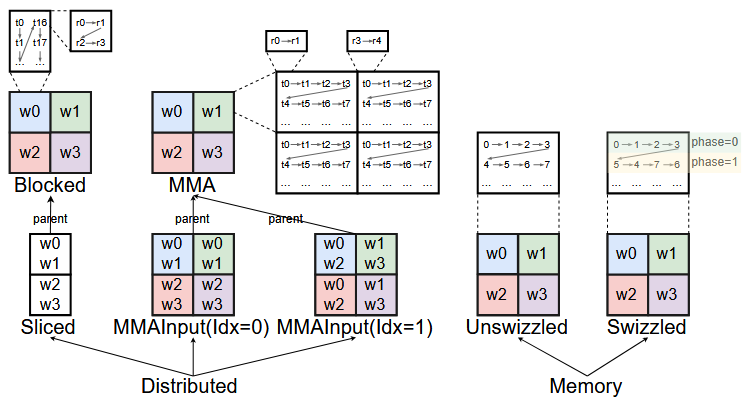

# Triton Layout  

## Intro to Layout
To start with, we will first explain what is layout, why layout concept is important, and how layout is used in triton compiler.  

### What is Layout?  
Follwing is a definition of Triton Layout.
> TritonGPU Tensors differ from usual tensors in that they contain a **layout** attribute which determines how the data should be partitioned across CUDA threads. Formally speaking, we define a layout as a function $\mathcal{L}$ that maps a multi-dimensional tensor index $i \in \mathbb{Z}^{d}$ to a set of integers $T$ corresponding to the indices of the CUDA threads allowed to access some data at index $i$.  

To make it more illustrative, below is an example of Layout function: 
$\mathcal{L}(0, 0) = {0, 4}$  
$\mathcal{L}(0, 1) = {1, 5}$   
$\mathcal{L}(1, 0) = {2, 6}$   
$\mathcal{L}(1, 1) = {3, 7}$

Then, attaching $\mathcal{L}$ to a tensor $T$ would mean that:
- T[0,0] is owned by both cuda thread 0 and 4
- T[0,1] is owned by both cuda thread 1 and 5
- T[1,0] is owned by both cuda thread 2 and 6
- T[1,1] is owned by both cuda thread 3 and 7

### Why Layout?  

### How Layout is used?   
  

Above fig shows the overall pipeline of Triton, from Triton lang -> Triton IR -> TritonGPU IR -> LLVM IR ... There are two main differences between Triton IR and TritonGPU IR:  

* Layout Attribute
* Triton GPU specific op

In the `Convert to TTGPU IR` phase, Layout Attribute is attatched to Triton IR. Below is a simple example of this transformation:  

`IR before conversion`
```cpp
module {
  tt.func public @add_kernel(%arg0: !tt.ptr<f32> {tt.divisibility = 16 : i32} loc("/mnt/home/douliyang/triton-workspace/triton-tutorial/tutorial/Triton-101/Debug/vector_add.py":32:0), %arg1: !tt.ptr<f32> {tt.divisibility = 16 : i32} loc("/mnt/home/douliyang/triton-workspace/triton-tutorial/tutorial/Triton-101/Debug/vector_add.py":32:0), %arg2: !tt.ptr<f32> {tt.divisibility = 16 : i32} loc("/mnt/home/douliyang/triton-workspace/triton-tutorial/tutorial/Triton-101/Debug/vector_add.py":32:0), %arg3: i32 {tt.divisibility = 16 : i32} loc("/mnt/home/douliyang/triton-workspace/triton-tutorial/tutorial/Triton-101/Debug/vector_add.py":32:0)) attributes {noinline = false} { ... }
}
```

`IR after conversion`
```cpp
#blocked = #ttg.blocked<{sizePerThread = [1], threadsPerWarp = [32], warpsPerCTA = [4], order = [0]}>
#loc = loc("/mnt/home/douliyang/triton-workspace/triton-tutorial/tutorial/Triton-101/Debug/vector_add.py":32:0)
module attributes {"ttg.num-ctas" = 1 : i32, "ttg.num-warps" = 4 : i32, ttg.target = "cuda:86", "ttg.threads-per-warp" = 32 : i32} {
  tt.func public @add_kernel(%arg0: !tt.ptr<f32> {tt.divisibility = 16 : i32} loc("/mnt/home/douliyang/triton-workspace/triton-tutorial/tutorial/Triton-101/Debug/vector_add.py":32:0), %arg1: !tt.ptr<f32> {tt.divisibility = 16 : i32} loc("/mnt/home/douliyang/triton-workspace/triton-tutorial/tutorial/Triton-101/Debug/vector_add.py":32:0), %arg2: !tt.ptr<f32> {tt.divisibility = 16 : i32} loc("/mnt/home/douliyang/triton-workspace/triton-tutorial/tutorial/Triton-101/Debug/vector_add.py":32:0), %arg3: i32 {tt.divisibility = 16 : i32} loc("/mnt/home/douliyang/triton-workspace/triton-tutorial/tutorial/Triton-101/Debug/vector_add.py":32:0)) attributes {noinline = false} { ... }
}
```    

In triton-gpu phase, `convert-layout` op is applied to transform a kind of layout to another kind, to better utilize GPU memory and compute capacity. Below are some common conversion:  

- **`#shared → #blocked`**  
  Represents loading data from **shared memory** into the **register file**.  
  A **swizzle** transformation needs to be considered.  

- **`#blocked → #shared`**  
  Represents storing data from the **register file** back to **shared memory**.  
  The same **swizzle scheme** used in the previous step must be applied.  

- **`#mma → #blocked`**  
  Represents converting the output of a **DotOp** into a simpler layout for further computation.  
  Since this involves **cross-thread data transfer**, shared memory is usually used as an intermediate buffer.  

- **`#blocked → #dot_operand`**  
  Represents converting to the input format of a **DotOp**.  
  This step may also require writing to **shared memory** as an intermediate stage.  

Another key difference is triton-GPU ops:  

> Compared with the **Triton Dialect**, the **TritonGPU Dialect** introduces GPU hardware–specific operations and types.  
> It provides the following layouts:  
> 
> - **`async_wait(N: int) -> ()`**  
>   Directly maps to the PTX instruction `cp.async.wait_group N`.  
> 
> - **`alloc_tensor() -> Tensor`**  
>   Allocates a tensor in **shared memory**.  
> 
> - **`insert_slice_async(slice: PtrTensor, dst: Tensor, index: int, mask: i1 ...) -> Tensor`**  
>   Asynchronously inserts a slice into a tensor allocated in shared memory (produced by `alloc_tensor`).  
> 
> - **`convert_layout(src: Tensor) -> Tensor`**  
>   Converts the **data layout** of a tensor.  
> 
> The first three operations are mainly used in **pipeline** and **prefetch** optimizations (not the focus of this blog).  
> By contrast, the **`convert_layout`** operation plays a key role in the **type system** of the TritonGPU Dialect, which will be discussed later.


## SharedLayout 
Swizzle memory to help avoid bank conflict cases.

## DistributedLayout
Distribute tensor to thread, describe the memory access pattern for tensors.

### BlockedLayout
Load & Store access pattern, help enable memory coalesce optimization(quite different from CUDA memory coalesce opt:key:).

### MMA Layout & DotOperand Layout

### Slice Layout

### CTA Layout (Hopper only)

All these layouts are now unified via a concept called **Linear Layout**. Refer to [Triton Linear Layout: Concept](https://www.lei.chat/posts/triton-linear-layout-concept/) and [Linear Layouts paper](http://arxiv.org/abs/2505.23819) for further understanding.

## Unifed Layout: Linear layout

## Tools for Layout dump
As triton layout contains many math calculations, to help developers and users fully understand it, triton provides triton-tensor-layout tool. Use -h to show its arguments:

```shell
USAGE: triton-tensor-layout [options]

OPTIONS:

Available Print Options:
Options for the tensor layout printing.

  --alias-names=<name1,name2,name3,...> - A list of alias names (separated by comma) of the layout attributes in the input file
  -i <filename>                         - File that contains the tensor data layout attributes
  -l <layout-string>                    - Tensor data layout attribute in string
  -o <filename>                         - Output file to write the layout into
  -t <tensor-type>                      - Tensor shape and element type (e.g., tensor<2x2xf32>)
  --use-hw-view                         - Print the layout in hardware point of view. This means the output is from the warp's perspective. Otherwise, the output is from the tensor's perspective (e.g., each element maps to xxx thread).

Generic Options:

  --help                                - Display available options (--help-hidden for more)
  --help-list                           - Display list of available options (--help-list-hidden for more)
  --version                             - Display the version of this progra
```

Below shows a simple sample for blocked layout:  

```shell
triton-tensor-layout -l "#ttg.blocked<{sizePerThread =
 [1, 4], threadsPerWarp = [4, 8], warpsPerCTA = [1, 1], order = [1, 0]}>" -t "tensor<4x32xf16>"
```

Output of this command is as below, output is a view from individual tensor idx, which shows how each tensor item is assigned to threads and its register.

```shell
Print layout attribute: #ttg.blocked<{sizePerThread = [2, 2], threadsPerWarp = [8, 4], warpsPerCTA = [1, 2], order = [1, 0]}>
[[ T0:0,  T0:1,  T0:2,  T0:3,  T1:0,  T1:1,  T1:2,  T1:3,  T2:0,  T2:1,  T2:2,  T2:3,  T3:0,  T3:1,  T3:2,  T3:3,  T4:0,  T4:1,  T4:2,  T4:3,  T5:0,  T5:1,  T5:2,  T5:3,  T6:0,  T6:1,  T6:2,  T6:3,  T7:0,  T7:1,  T7:2,  T7:3]
[  T8:0,  T8:1,  T8:2,  T8:3,  T9:0,  T9:1,  T9:2,  T9:3, T10:0, T10:1, T10:2, T10:3, T11:0, T11:1, T11:2, T11:3, T12:0, T12:1, T12:2, T12:3, T13:0, T13:1, T13:2, T13:3, T14:0, T14:1, T14:2, T14:3, T15:0, T15:1, T15:2, T15:3]
[ T16:0, T16:1, T16:2, T16:3, T17:0, T17:1, T17:2, T17:3, T18:0, T18:1, T18:2, T18:3, T19:0, T19:1, T19:2, T19:3, T20:0, T20:1, T20:2, T20:3, T21:0, T21:1, T21:2, T21:3, T22:0, T22:1, T22:2, T22:3, T23:0, T23:1, T23:2, T23:3]
[ T24:0, T24:1, T24:2, T24:3, T25:0, T25:1, T25:2, T25:3, T26:0, T26:1, T26:2, T26:3, T27:0, T27:1, T27:2, T27:3, T28:0, T28:1, T28:2, T28:3, T29:0, T29:1, T29:2, T29:3, T30:0, T30:1, T30:2, T30:3, T31:0, T31:1, T31:2, T31:3]]
```

If we see the `Ouput[i][j] = Ta:b`, that means i row and j col of tensor element is loaded/stored by thread a and its b register. 

Another version is try to use `--use-hw-view` to show the output from the warp's perspective. The output is:  

```shell
Print layout attribute: #ttg.blocked<{sizePerThread = [2, 2], threadsPerWarp = [8, 4], warpsPerCTA = [1, 2], order = [1, 0]}>
Warp0:
( 0, 0), ( 0, 2), ( 0, 4), ( 0, 6), ( 2, 0), ( 2, 2), ( 2, 4), ( 2, 6), ( 4, 0), ( 4, 2), ( 4, 4), ( 4, 6), ( 6, 0), ( 6, 2), ( 6, 4), ( 6, 6), ( 8, 0), ( 8, 2), ( 8, 4), ( 8, 6), (10, 0), (10, 2), (10, 4), (10, 6), (12, 0), (12, 2), (12, 4), (12, 6), (14, 0), (14, 2), (14, 4), (14, 6)
( 0, 1), ( 0, 3), ( 0, 5), ( 0, 7), ( 2, 1), ( 2, 3), ( 2, 5), ( 2, 7), ( 4, 1), ( 4, 3), ( 4, 5), ( 4, 7), ( 6, 1), ( 6, 3), ( 6, 5), ( 6, 7), ( 8, 1), ( 8, 3), ( 8, 5), ( 8, 7), (10, 1), (10, 3), (10, 5), (10, 7), (12, 1), (12, 3), (12, 5), (12, 7), (14, 1), (14, 3), (14, 5), (14, 7)
( 1, 0), ( 1, 2), ( 1, 4), ( 1, 6), ( 3, 0), ( 3, 2), ( 3, 4), ( 3, 6), ( 5, 0), ( 5, 2), ( 5, 4), ( 5, 6), ( 7, 0), ( 7, 2), ( 7, 4), ( 7, 6), ( 9, 0), ( 9, 2), ( 9, 4), ( 9, 6), (11, 0), (11, 2), (11, 4), (11, 6), (13, 0), (13, 2), (13, 4), (13, 6), (15, 0), (15, 2), (15, 4), (15, 6)
( 1, 1), ( 1, 3), ( 1, 5), ( 1, 7), ( 3, 1), ( 3, 3), ( 3, 5), ( 3, 7), ( 5, 1), ( 5, 3), ( 5, 5), ( 5, 7), ( 7, 1), ( 7, 3), ( 7, 5), ( 7, 7), ( 9, 1), ( 9, 3), ( 9, 5), ( 9, 7), (11, 1), (11, 3), (11, 5), (11, 7), (13, 1), (13, 3), (13, 5), (13, 7), (15, 1), (15, 3), (15, 5), (15, 7)
Warp1:
( 0, 8), ( 0,10), ( 0,12), ( 0,14), ( 2, 8), ( 2,10), ( 2,12), ( 2,14), ( 4, 8), ( 4,10), ( 4,12), ( 4,14), ( 6, 8), ( 6,10), ( 6,12), ( 6,14), ( 8, 8), ( 8,10), ( 8,12), ( 8,14), (10, 8), (10,10), (10,12), (10,14), (12, 8), (12,10), (12,12), (12,14), (14, 8), (14,10), (14,12), (14,14)
( 0, 9), ( 0,11), ( 0,13), ( 0,15), ( 2, 9), ( 2,11), ( 2,13), ( 2,15), ( 4, 9), ( 4,11), ( 4,13), ( 4,15), ( 6, 9), ( 6,11), ( 6,13), ( 6,15), ( 8, 9), ( 8,11), ( 8,13), ( 8,15), (10, 9), (10,11), (10,13), (10,15), (12, 9), (12,11), (12,13), (12,15), (14, 9), (14,11), (14,13), (14,15)
( 1, 8), ( 1,10), ( 1,12), ( 1,14), ( 3, 8), ( 3,10), ( 3,12), ( 3,14), ( 5, 8), ( 5,10), ( 5,12), ( 5,14), ( 7, 8), ( 7,10), ( 7,12), ( 7,14), ( 9, 8), ( 9,10), ( 9,12), ( 9,14), (11, 8), (11,10), (11,12), (11,14), (13, 8), (13,10), (13,12), (13,14), (15, 8), (15,10), (15,12), (15,14)
( 1, 9), ( 1,11), ( 1,13), ( 1,15), ( 3, 9), ( 3,11), ( 3,13), ( 3,15), ( 5, 9), ( 5,11), ( 5,13), ( 5,15), ( 7, 9), ( 7,11), ( 7,13), ( 7,15), ( 9, 9), ( 9,11), ( 9,13), ( 9,15), (11, 9), (11,11), (11,13), (11,15), (13, 9), (13,11), (13,13), (13,15), (15, 9), (15,11), (15,13), (15,15)
```

This output should be viewed in column order. In a column, it shows the memory access of each thread.


## References
1. [OpenAI Triton: Why layout is important](http://zhuanlan.zhihu.com/p/672720213)
2. [Triton Linear Layout: Concept](https://www.lei.chat/posts/triton-linear-layout-concept/)
3. [【AI实操 · 优化篇】07 Triton布局介绍](https://www.bilibili.com/video/BV1F45HzLEHo?spm_id_from=333.788.videopod.sections&vd_source=7cc24e214309f4db17f1dda017fc6683)
4. [Code tells everything](include/triton/Dialect/TritonGPU/IR/TritonGPUAttrDefs.td)
5. [Triton 迁移记录](https://superjomn.github.io/posts/triton-mlir-publish/)